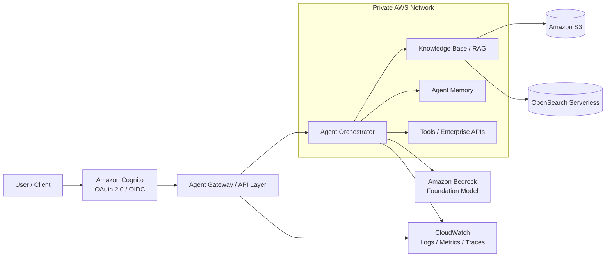

# Agentic AI Reference Architecture on AWS

Production-oriented reference architecture for secure Agentic AI workloads on AWS using Amazon Bedrock, AgentCore concepts, RAG, OAuth 2.0/OIDC, memory, private networking and observability.

## Goals

This repository demonstrates how to design an enterprise-grade agentic AI platform with clear separation between identity, orchestration, retrieval, memory, tools, networking and observability.

The focus is not only on making an agent respond, but on documenting the architectural decisions required to operate agentic workloads safely and predictably in production.

## High-level architecture



## Architecture principles

- **Zero-trust access:** clients authenticate with OAuth 2.0/OIDC before invoking agent capabilities.
- **Private-by-default networking:** runtime components are designed to operate in private subnets with controlled VPC endpoints.
- **Least privilege:** IAM permissions are scoped per runtime, tool and data source.
- **Explicit orchestration:** the agent does not receive unrestricted access to infrastructure or enterprise systems.
- **Grounded generation:** domain responses can be augmented through RAG and governed data sources.
- **Durable context:** short- and long-term memory are treated as independent architectural concerns.
- **Observability first:** prompts, tool calls, latency, errors and security events must be measurable.
- **Infrastructure as Code:** infrastructure definitions belong in version control.

## Repository structure

```text
.
├── README.md
├── docs/
│   ├── architecture.md
│   └── decisions/
│       └── ADR-001-architecture-style.md
├── infrastructure/
│   └── terraform/
├── src/
│   └── orchestrator/
├── tests/
└── .github/
    └── workflows/
```

## Main components

| Layer | Responsibility | AWS-oriented implementation |
|---|---|---|
| Identity | Authentication and token issuance | Amazon Cognito |
| Entry point | Validated access to agent runtime | Agent gateway / API layer |
| Orchestration | Planning, model invocation and tool routing | Agent runtime / orchestrator |
| Model | Reasoning and generation | Amazon Bedrock |
| Retrieval | Grounding against enterprise knowledge | Knowledge Base + OpenSearch Serverless + S3 |
| Memory | Conversation and durable agent context | Agent memory abstraction |
| Tools | Controlled execution against external systems | Internal APIs / Lambda / services |
| Networking | Isolation and private service access | VPC, private subnets, security groups, VPC endpoints |
| Observability | Logs, metrics, traces and auditability | Amazon CloudWatch |

## Security model

The target design assumes that no tool is implicitly trusted. Every tool exposed to the orchestrator should have:

1. a narrow contract;
2. its own authorization boundary;
3. input validation;
4. audit logging;
5. timeout and failure handling;
6. explicit data-access permissions.

Secrets and credentials must never be embedded in source code or prompts.

## Roadmap

- [x] Define reference architecture
- [x] Document architecture principles
- [x] Add first Architecture Decision Record
- [ ] Implement local orchestrator skeleton
- [ ] Add Bedrock model adapter
- [ ] Add RAG adapter
- [ ] Add memory abstraction
- [ ] Add tool registry
- [ ] Add Terraform networking baseline
- [ ] Add Cognito configuration
- [ ] Add observability baseline
- [ ] Add automated tests
- [ ] Add GitHub Actions CI
- [ ] Add threat model and cost notes

## Status

This repository is intentionally built as a reference implementation. Some AWS resources are represented first as architectural abstractions and will be progressively replaced by deployable infrastructure and executable code.

## Author

**Luciano Gonçalves**  
Software Engineer — Backend, Cloud Architecture, Data and Artificial Intelligence

GitHub: [devLJMG](https://github.com/devLJMG)
