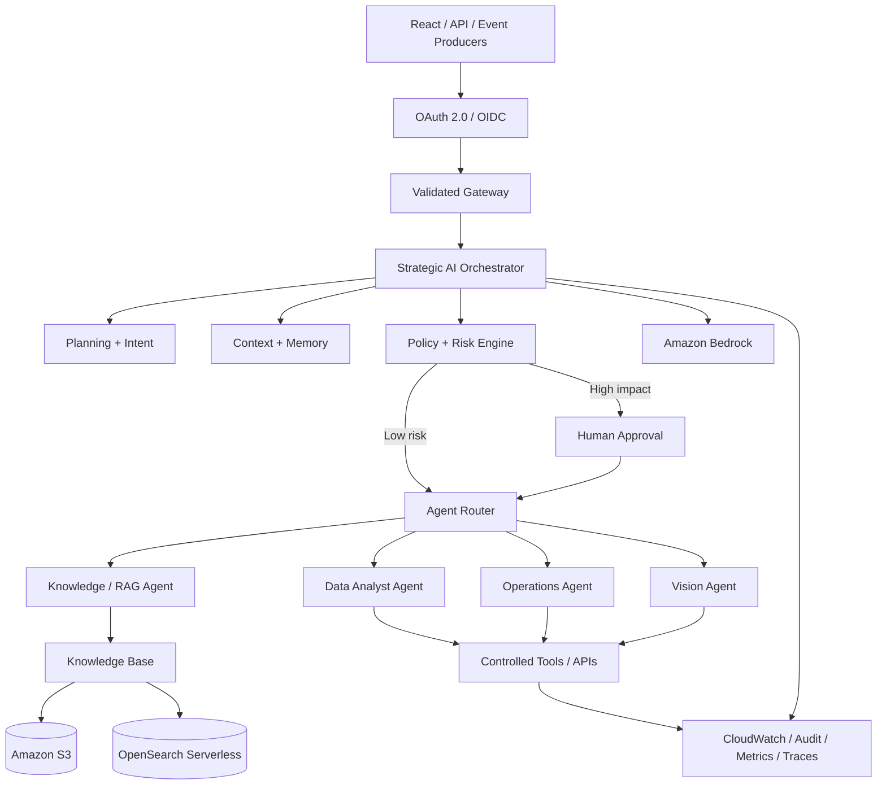

# Agentic AI Reference Architecture on AWS

Production-oriented reference architecture for **secure multi-agent AI systems** on AWS, combining strategic orchestration, specialized agents, RAG, memory, controlled tool execution, human-in-the-loop governance, private networking and observability.

> This is a sanitized reference architecture and implementation project. It contains no proprietary employer code, customer data, credentials or private infrastructure identifiers.

## What this project demonstrates

This repository is designed around a central engineering question:

**How do we move from an LLM that answers questions to an AI system that can reason, delegate work, use enterprise data and execute controlled actions safely?**

The architecture separates probabilistic reasoning from deterministic authorization and execution controls.

## High-level architecture



## Core capabilities

- **Strategic orchestration** — intent classification, planning, delegation and result aggregation.
- **Multi-agent execution** — specialized agents operate behind explicit capability boundaries.
- **Retrieval-Augmented Generation** — enterprise knowledge can ground model reasoning.
- **Memory architecture** — conversation and durable context are independent concerns.
- **Decision and risk engine** — deterministic policy evaluates proposed actions before execution.
- **Human-in-the-loop** — high-impact operations can require explicit approval.
- **Controlled tool use** — model output never becomes execution authority by itself.
- **Zero-trust identity** — OAuth 2.0/OIDC and least-privilege access boundaries.
- **Private networking** — workloads are designed for private AWS connectivity where appropriate.
- **Observability** — decisions, tool calls, latency, failures and policy events are measurable.
- **Infrastructure as Code** — deployment infrastructure will be represented through Terraform.

## Decision lifecycle

```text
Request / Event
      |
      v
Identity + Authorization
      |
      v
Intent Classification
      |
      v
Context + Memory
      |
      v
Planning
      |
      v
Policy / Risk Evaluation
      |
      +---- high risk ----> Human Approval
      |                         |
      +-------------------------+
      |
      v
Agent Selection
      |
      v
Tool Authorization
      |
      v
Bounded Execution
      |
      v
Result Aggregation
      |
      v
Audit + Metrics + Response
```

## Architecture principles

- **Model output is untrusted.** A model may propose an operation but cannot authorize it.
- **Least privilege.** IAM and application permissions are scoped by capability.
- **Explicit orchestration.** Planning, routing and execution are visible architectural responsibilities.
- **Deterministic controls around probabilistic reasoning.** Policy enforcement lives outside prompts.
- **Grounded generation.** RAG uses governed and authorized knowledge sources.
- **Failure isolation.** Retrieval, memory, models and tools can fail independently.
- **Observability first.** Correlation IDs connect the complete decision path.
- **Private by default.** Network exposure is minimized.
- **Infrastructure as Code.** Infrastructure decisions are reviewable and reproducible.

## Repository structure

```text
.
├── README.md
├── docs/
│   ├── architecture.md
│   ├── multi-agent-orchestration.md
│   └── decisions/
│       ├── ADR-001-architecture-style.md
│       └── ADR-002-human-in-the-loop.md
├── infrastructure/
│   └── terraform/
├── src/
│   └── orchestrator/
├── tests/
└── .github/
    └── workflows/
```

## Planned implementation layers

| Layer | Responsibility |
|---|---|
| API / Events | Receive user requests and machine-generated events |
| Identity | Authentication and caller context |
| Orchestrator | Intent, planning, delegation and aggregation |
| Policy Engine | Risk classification and execution authorization |
| Model Port | Foundation-model abstraction |
| Retrieval Port | RAG and governed enterprise knowledge |
| Memory Port | Session and durable context |
| Agent Registry | Specialist capability discovery and routing |
| Tool Registry | Schema validation and controlled side effects |
| Approval Service | Durable human-in-the-loop workflow |
| Telemetry | Logs, metrics, traces, audit and evaluation |

## Specialized agents

The architecture currently models four specialist roles:

**Knowledge Agent** — document retrieval, RAG and grounded answers.  
**Data Analyst Agent** — structured data, metrics and analytical workflows.  
**Operations Agent** — approved operational actions through controlled tools.  
**Vision Agent** — computer-vision events and inference results participating in larger decisions.

These roles are intentionally independent from specific frameworks. The orchestration domain should remain understandable even if the underlying agent framework changes.

## Security model

Every executable tool should provide a narrow schema, independent authorization, validated input, bounded execution, timeout behavior, audit events and explicit data permissions.

High-impact operations are routed through a policy-driven human approval boundary. See [`ADR-002`](docs/decisions/ADR-002-human-in-the-loop.md).

## Documentation

- [`Architecture`](docs/architecture.md)
- [`Multi-Agent Orchestration`](docs/multi-agent-orchestration.md)
- [`ADR-001 — Ports and Adapters`](docs/decisions/ADR-001-architecture-style.md)
- [`ADR-002 — Human-in-the-Loop`](docs/decisions/ADR-002-human-in-the-loop.md)

## Roadmap

### Architecture
- [x] Define enterprise Agentic AI reference architecture
- [x] Define multi-agent orchestration model
- [x] Define trust and execution boundaries
- [x] Define human-in-the-loop decision boundary

### Runtime
- [ ] Implement `AgentOrchestrator`
- [ ] Implement `ModelPort`
- [ ] Implement `RetrievalPort`
- [ ] Implement `MemoryPort`
- [ ] Implement `ToolPort`
- [ ] Implement agent registry
- [ ] Implement deterministic policy/risk engine
- [ ] Add execution budgets, timeouts and idempotency

### AI integrations
- [ ] Add Amazon Bedrock adapter
- [ ] Add RAG adapter
- [ ] Add durable memory adapter
- [ ] Add evaluation dataset and agent quality metrics

### Platform
- [ ] Add React operations console
- [ ] Add API layer
- [ ] Add Cognito/OAuth configuration
- [ ] Add Terraform networking baseline
- [ ] Add private connectivity
- [ ] Add CloudWatch observability
- [ ] Add GitHub Actions CI
- [ ] Add Docker development environment

### Production engineering
- [ ] Add automated tests
- [ ] Add threat model
- [ ] Add cost model
- [ ] Add SLOs and operational dashboards
- [ ] Add failure and recovery scenarios

## Status

The project is being built architecture-first: domain boundaries and decisions are documented before concrete cloud adapters are introduced. This keeps the core orchestration testable and prevents the implementation from becoming a collection of tightly coupled SDK calls.

## Author

**Luciano Gonçalves**  
Software Engineer — AI Systems, Backend, Cloud Architecture and Data Engineering

GitHub: [devLJMG](https://github.com/devLJMG)
