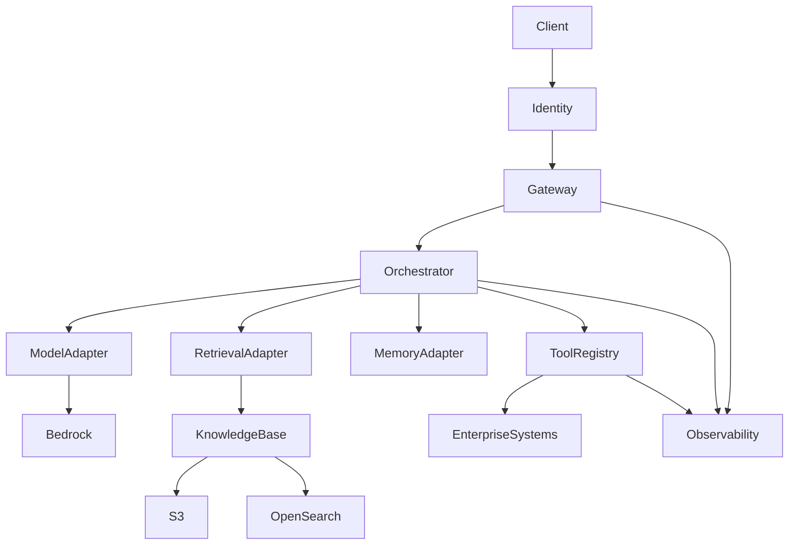
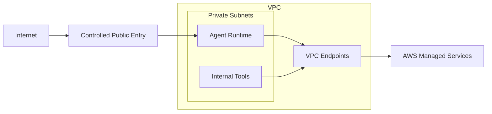

# Architecture

## Context

Enterprise agentic AI systems introduce a different risk model from conventional request/response applications. A model can reason over user input, retrieve organizational knowledge and select tools that cause side effects. For that reason, identity, authorization, retrieval, memory and tool execution must be explicit architectural boundaries.

## Request flow

1. The client authenticates through an OAuth 2.0/OIDC identity provider.
2. The gateway validates the caller and the requested agent capability.
3. The orchestrator receives a normalized request and correlation identifier.
4. The orchestrator selects model, retrieval, memory and tool capabilities according to policy.
5. Retrieval augments the model context only with authorized knowledge.
6. Tool calls pass through explicit contracts and authorization boundaries.
7. The final response is returned to the caller.
8. Operational events are emitted for logging, metrics, tracing and audit.

## Logical view

## Trust boundaries

### Public/client boundary

The client is untrusted. Authentication proves an identity but does not grant unrestricted agent capabilities.

### Gateway boundary

The gateway validates tokens, request shape, quotas and coarse-grained authorization before requests reach the orchestrator.

### Agent boundary

Model output is treated as untrusted input to downstream systems. A model requesting a tool invocation is not sufficient authorization to execute that tool.

### Tool boundary

Each tool owns its validation and authorization logic. High-impact actions should support additional policy checks or human approval.

### Data boundary

Retrieval must respect data classification and caller authorization. RAG must not become a mechanism for bypassing access controls.

## Networking

The target deployment places runtime workloads in private networking wherever supported. Outbound access is minimized and AWS service access should use private connectivity when appropriate.

## Failure strategy

The architecture assumes partial failure. Model invocation, retrieval, memory and tools can fail independently. The orchestrator should therefore use bounded timeouts, structured errors, retry only idempotent operations, propagate correlation IDs and avoid silently converting tool failures into successful answers.

## Observability

Minimum production telemetry should include request count, end-to-end latency, model latency, retrieval latency, tool latency, tool failures, token consumption, authorization failures and safety-policy events.

Logs should be structured and correlated, while avoiding unnecessary storage of sensitive prompt or retrieved content.

## Evolution

The initial implementation keeps AWS integrations behind interfaces. This allows local tests without AWS credentials and makes architectural boundaries visible in the source code before real infrastructure is introduced.
