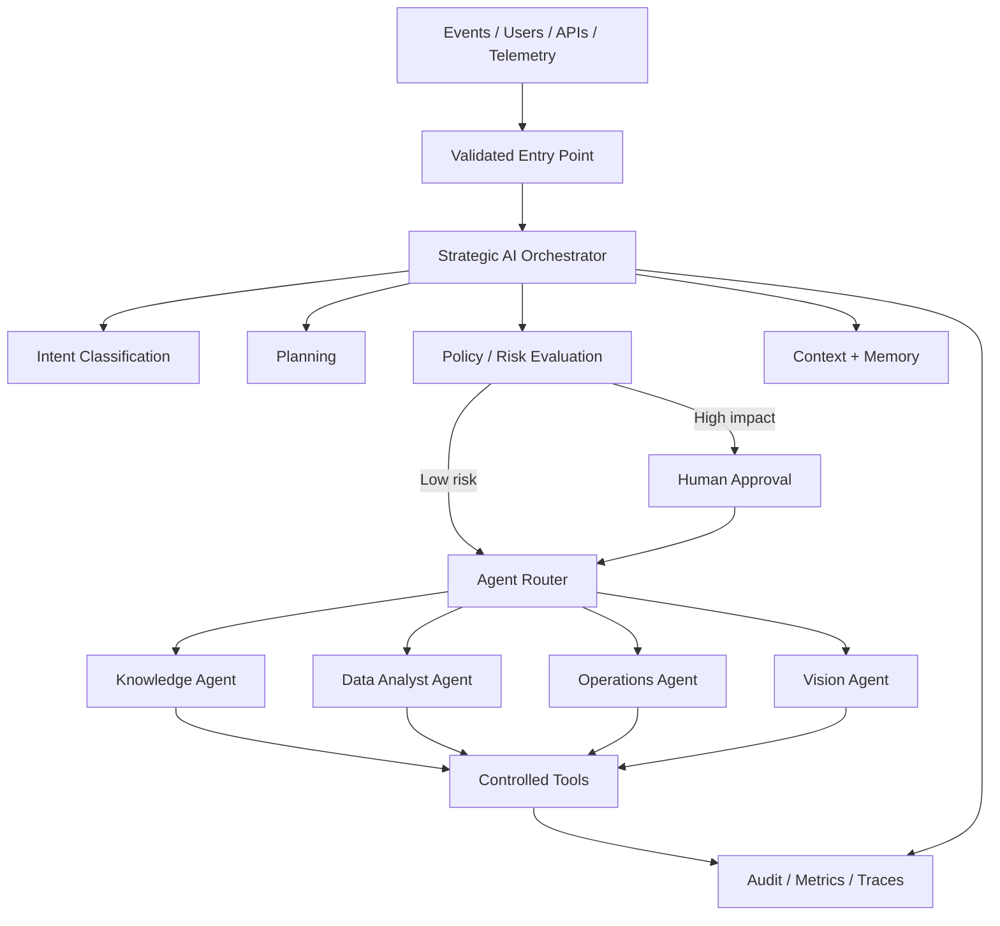

# Multi-Agent Orchestration

## Objective

The reference architecture evolves beyond a single conversational agent. The target platform supports a strategic orchestrator that receives events or user requests, evaluates context and risk, and delegates work to specialized agents through explicit contracts.

## Conceptual flow



## Strategic orchestration responsibilities

The orchestrator owns decisions that must remain centralized and auditable:

- classify the incoming objective or event;
- determine whether retrieval, reasoning or tool execution is required;
- build an execution plan;
- select one or more specialized agents;
- evaluate operation risk before side effects;
- decide whether human approval is required;
- enforce execution budgets and timeouts;
- aggregate agent outputs;
- emit structured telemetry for the full decision path.

Specialized agents do not receive unrestricted infrastructure access. Their scope is defined by capability contracts and policy.

## Agent roles

### Knowledge Agent

Responsible for RAG, document retrieval, grounding and evidence-aware responses.

### Data Analyst Agent

Responsible for structured datasets, metrics, SQL/data APIs and analytical transformations.

### Operations Agent

Responsible for operational workflows and side-effecting actions exposed through approved tools.

### Vision Agent

Responsible for image/video-derived events and computer-vision inference results that may participate in larger decisions.

## Decision lifecycle

```text
Receive event/request
       |
       v
Authenticate + authorize
       |
       v
Classify intent
       |
       v
Load context + memory
       |
       v
Create candidate plan
       |
       v
Evaluate policy and risk
       |
       +---- high-impact ----> Human approval
       |                           |
       +---------------------------+
       |
       v
Delegate to specialist agent(s)
       |
       v
Validate tool requests
       |
       v
Execute bounded actions
       |
       v
Aggregate result
       |
       v
Audit + metrics + final response
```

## Human-in-the-loop

Human approval is an architectural capability rather than an exception. Example cases include financial operations, destructive changes, privileged data access, external communications, or any action above a configured risk threshold.

The approval request should include the proposed action, rationale, expected side effects, required permissions and expiration time.

## Engineering constraints

The orchestrator should support deterministic policy checks around probabilistic model reasoning. Model output can propose actions, but authorization and execution policy must remain outside the model.

Important controls include idempotency keys, execution budgets, retry rules, circuit breakers, correlation IDs, per-tool authorization, structured schemas and immutable audit events.
